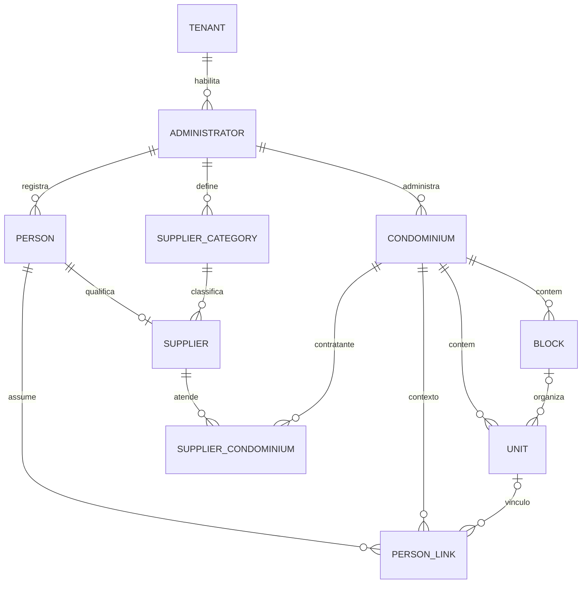
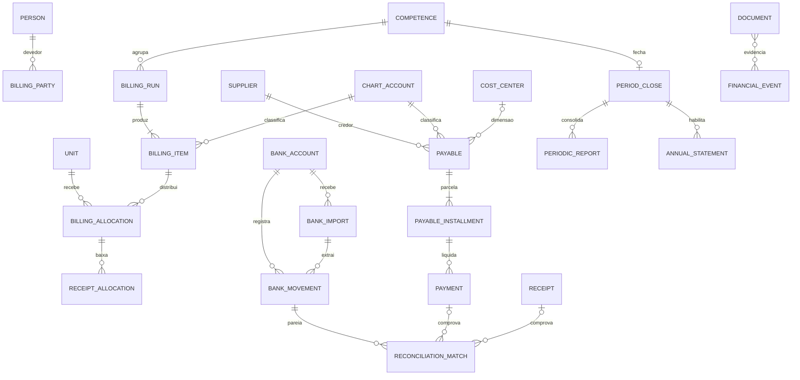
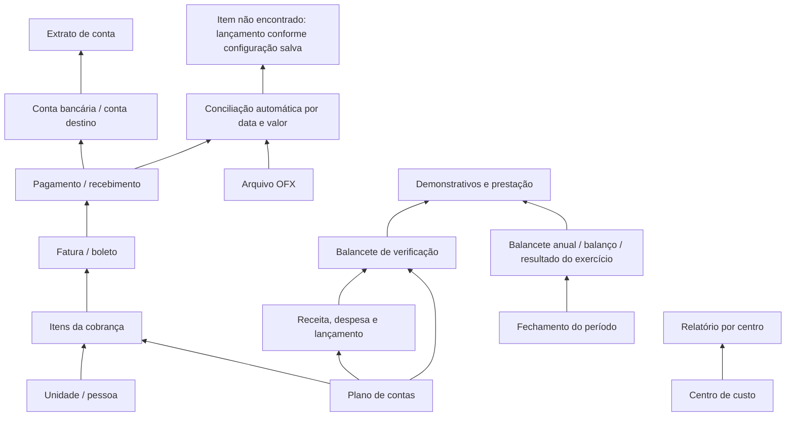

# Modelo conceitual original do Moves ERP

Este modelo parte do código/migrations Moves existente e da estrutura funcional observada, sem copiar implementação proprietária. Recursos ainda não auditados são requisitos/propostas, não fatos sobre o APControle.

## Núcleo implementado

- `erp_administrators`: administradora associada ao tenant de plataforma.
- `erp_condominiums`: condomínio pertencente à administradora, com nome legal/comercial, identificador fiscal, status e fuso horário.
- `erp_blocks` / `erp_units`: estrutura física. Código de unidade é único dentro do condomínio; bloco é opcional, e FK composta impede unidade apontar a bloco de outro condomínio.
- `erp_people`: pessoa física/jurídica registrada uma vez por administradora; documento opcional e status.
- `erp_person_links`: relação temporal pessoa–condomínio e, opcionalmente, pessoa–unidade. Papel inclui proprietário, inquilino, morador, síndico, vice, conselho e procurador. Guarda datas, estado, origem e autoria.
- `erp_supplier_categories`, `erp_suppliers`, `erp_supplier_condominiums`: perfil de fornecedor qualifica uma pessoa existente, usa categoria configurável e mantém relação temporal de atendimento a vários condomínios.
- Restrição tenant aparece em índices/FKs compostas; usuários/autores ficam auditáveis.

## Modelo alvo para fechar o ciclo operacional (a implementar)

As entidades alvo são propostas pelos fluxos visíveis de títulos, parcelas, faturas, contas, movimentos, relatórios e fechamento, e pelo requisito explícito de cobrança consolidada Moves. Não significam que esses fluxos já existam no código.

## Dependências de relatório confirmadas na interface

Legenda epistemológica: linhas de `BankFile → Match`, comparação por data/valor, comportamento de item não encontrado e agrupamento por descrição são **texto explícito de ajuda da tela OFX**. `Close → Annual` é comprovado pelos campos de seleção de período de fechamento nos relatórios anuais/balanço/resultado. Plano de contas aparece em configurações e filtros/opções de relatórios; `Chart → Transaction` e dependência da prestação em relação ao ledger são dependências funcionais **fortemente inferidas**, ainda sem visualizar um resultado gerado. O campo de centro de custo no relatório e a aba de centros na configuração vinculada a condomínio sustentam provável escopo por condomínio, mas não comprovam relação obrigatória centro–conta, centro–lançamento nem centro–rateio. Não foi encontrada tela própria de conciliação; a função é declarada dentro do OFX.

### Invariantes propostas

1. `administrator_id` e `tenant_id` são resolvidos no servidor e todas as FKs financeiras validam condomínio, pessoa e fornecedor dentro do mesmo tenant.
2. Pessoa/unidade usam vínculo temporal; mudanças encerram uma relação e criam outra, sem sobrescrever história. Papéis simultâneos são possíveis conforme validação do negócio.
3. Cobrança consolidada é uma apresentação/agrupamento de `billing_item` e `billing_allocation`, nunca perde a distribuição original por unidade. Pagamento parcial gera alocações explícitas.
4. Valores monetários usam decimal/moeda explícitos; lançamentos publicados e movimentos conciliados são corrigidos por eventos/estornos, não por edição silenciosa.
5. Fechamento referencia versão/snapshot dos eventos contabilizados e define reabertura autorizada, mantendo trilha anterior.
6. Relatórios derivam do ledger/eventos contabilizados, não de totais duplicados mantidos em agregados mutáveis.
7. Documentos guardam metadados/hash e ACL; acesso não é herdado apenas da existência do link.
8. Ações críticas registram autor, horário, escopo, motivo, correlação e resultado, sem incluir segredos.

## Entidades avaliadas

| Entidade | Estado | Evidência/decisão |
|---|---|---|
| Administradora / tenant | Confirmada no Moves | `erp_administrators`, tenant e grants |
| Condomínio | Confirmada | migration e service; campos cadastrais ainda parciais |
| Bloco / unidade | Confirmadas | migration estrutura física |
| Pessoa | Confirmada | PF/PJ por administradora |
| Proprietário, morador, inquilino, síndico, conselho, procurador | Confirmados como papéis do vínculo Moves; no APControle parcialmente observados | enum/validação de `erp_person_links`; não prova a mesma nomenclatura legada |
| Fração ideal | Confirmada como conceito APControle; não localizada no schema Moves visto | configurar por unidade/condomínio com regra e vigência explícitas |
| Fornecedor/categoria/atendimento | Confirmados | migrations ERP atuais |
| Conta/plano de contas/centro de custo | Confirmado como UI APControle; ausente como domínio financeiro Moves | alvo financeiro |
| Conta a pagar/receber, parcela, pagamento/recebimento | Confirmadas como conceitos operacionais do legado; não implementados no Moves | alvos separados com eventos e itens |
| Cobrança/fatura/item/alocação consolidada | Fatura observada; consolidada é diferencial Moves | separar execução de cobrança, item econômico e distribuição de unidade |
| Conta bancária/movimento/conciliação | Conta bancária indicada em menu; movimento/conciliação não comprovados no produto legado | alvos necessários P0 |
| Documento | Menus e anexos observados | entidade vinculável com autorização explícita |
| Competência/fechamento/prestação | Competência e fechamento descritos; prestação listada | ciclo contábil de destino |
| Contrato/orçamento/leitura/tarifa/medidor | Inventariados em menus, detalhes ainda não auditados | incluir apenas após complementar evidência e priorizar cadeia operacional |

## Cardinalidades financeiras observadas e grau de evidência

Esta tabela separa fatos de UI de hipóteses de modelagem. Nenhum exemplo singular prova cardinalidade universal.

| Relação conceitual | Evidência na interface | Estado |
|---|---|---|
| Fatura → item de cobrança | Um detalhe “Ver fatura” mostrou dois itens datados e um total. | **CONFIRMADA (1:N no exemplo)**; regra geral/itens elegíveis não comprovados. |
| Fatura → boleto | A lista de boletos filtrada pelo ID de uma fatura mostrou um boleto relacionado e pendente. | **CONFIRMADA (relação no exemplo)**; 1:1 versus 1:N geral não comprovado. |
| Conta a pagar → parcela | Há lista de títulos e lista separada de parcelas, com filtros/campos próprios; os resultados estavam vazios nesta sessão. | **INFERIDA** como relação; 1:N não comprovado por detalhe. |
| Parcela a pagar → pagamento | Colunas separadas para valor, valor pago, data de pagamento e estado sugerem registro de liquidação. | **INFERIDA**; quantidade de pagamentos, pagamento parcial e estorno não comprovados. |
| Conta a receber → parcela / parcela → recebimento | Listas separadas e ação de receber identificada no inventário anterior, mas sem registro acessível nesta consulta. | **INFERIDA**; cardinalidades, parciais e estorno não comprovados. |
| Recibo → origem financeira | Lista tem coluna Origem clicável; o menu chama o documento associado “Comprovante de pagamento”. | **INFERIDA**; vínculo exato e cardinalidade não comprovados. |
| Boleto → fatura(s) | Uma linha de boleto contém link para a fatura filtrada; coluna chama-se Cobrança(s). | **INFERIDA** para singular/plural como regra; a ligação de um boleto ao exemplo foi confirmada. |
| Prestação → período/condomínio | A listagem mostra condomínio, datas inicial/final, nome e estado. | **CONFIRMADA** como campos da prestação; associação de uma prestação a várias competências não comprovada. |
| Conta bancária → movimento / pagamento/recebimento → movimento | Contas bancárias aparecem em filtros/configuração e extrato é opção de relatório. | **NÃO COMPROVADA** como relação de registros subjacentes; evitar assumir fonte de saldo/ledger. |

**Fonte da verdade financeira:** permanece **NÃO COMPROVADA**. A UI expõe títulos, parcelas, pagamentos/valores pagos, recibos, boletos, movimentos contábeis, contas bancárias, OFX e relatórios; não foi seguro nem possível abrir resultado detalhado da prestação ou gerar relatórios para rastrear saldo até um registro canônico.

## Arquitetura e limites

Continuar no módulo `Moves\Modules\Erp`; Core permanece transversal. Controllers permanecem finos; regras em serviços ERP; persistência em repositories; contratos API versionados. Manter o Design System Moves. Talk/Support/Meu Dia recebem eventos/contexto autorizados e não se tornam fonte financeira.

## Atualização de cardinalidades e evidências de contexto B

| Relação | Observação read-only | Estado atualizado |
|---|---|---|
| Título a receber → parcela | Um detalhe consultivo mostrou quantidade de duas parcelas; cada linha expõe vencimento e competência. | **CONFIRMADA no exemplo (1:N)**; universalidade não comprovada. |
| Parcela a receber → recebimento | Há colunas de data/valor recebido no detalhe da parcela, sem evidência de pagamento efetivado. | **NÃO COMPROVADA** como vínculo persistido/cardinalidade. |
| Fatura → item | Detalhe histórico de uma fatura exibiu uma linha de taxa condominial; outra fatura observada anteriormente continha múltiplos itens. | **CONFIRMADA (1:N nos exemplos consultados)**; origem e elegibilidade dos itens não comprovadas. |
| Fatura → boleto(s) | Lista de boletos no recorte relacionado trouxe mais de um boleto com estado distinto; uma linha agregava múltiplas referências de cobrança. | Relação fatura-boleto observada; **M:N/inferida para a coleção**, regra de geração/reemissão não comprovada. |
| Boleto → cobrança(s) | A coluna Cobrança(s) continha múltiplas referências em uma linha observada. | **CONFIRMADA no exemplo** para múltiplas referências; natureza técnica e cardinalidade universal não comprovadas. |
| Recibo → despesa/pagamento | Lista exibe origem, tipo Despesa e estado Disponível; origem não aberta. | **NÃO COMPROVADA**. |
| Prestação → competência | A listagem associa nome e intervalo a uma prestação; sete prestações do contexto B estavam abertas. | Associação período/condomínio confirmada; conteúdo, fechamento e saldos não. |

Um exemplo não determina modelo global. Não acrescentar chave de ledger ou relação de pagamento ao desenho como fato de referência: `FONTE CANÔNICA FINANCEIRA` permanece **NÃO COMPROVADA**. Manter pagamentos, recebimentos, movimentos bancários e alocações como entidades alvo provisórias sujeitas a validação.

## Implementação Moves — fundação limitada de contas a receber

`erp_receivables` registra um título por administradora, condomínio, unidade e vínculo pessoal escolhido pelo operador. O vínculo precisa pertencer àquela unidade e estar ativo na data do cadastro. O título referencia o plano ativo do condomínio e duas contas analíticas ativas desse plano: uma de natureza ativo para recebíveis e uma de natureza receita.

`erp_receivable_installments` guarda uma ou mais parcelas com valor decimal explícito, vencimento e competência aberta do mesmo condomínio. **Um título para uma ou mais parcelas é decisão Moves**, motivada por um exemplo 1:N observado na referência, sem afirmar que essa cardinalidade seja universal no APControle. O operador informa o valor total e cada parcela; a soma exata em centavos precisa coincidir. Nenhum rateio ou valor é calculado automaticamente.

A criação do título, das parcelas e do evento `erp.receivable.created` ocorre em uma transação. FKs compostas preservam o mesmo administrador, condomínio, unidade, vínculo, plano, contas e competência. Listagem, detalhe, CSRF e autorização ERP estão implementados. Esta fundação não inclui recebimento, liquidação, baixa, reversão, cobrança, fatura, boleto, banco, conciliação, lançamento/ledger nem saldo. A conta analítica classifica o título; não representa movimento financeiro ou fonte canônica de saldo.

## Decisão pós-auditoria sobre fundação e limites do ledger

A tela do plano de contas confirmou árvore/classificações de ativos, passivos, patrimônio/resultado, receitas e despesas, contas especiais e transferência configurável entre contas. Ela também mostra a opção de centro de custo em detalhe de conta, sem prova do relacionamento de persistência ou lançamento. A configuração de boleto conecta conceitualmente banco, beneficiário, carteira/convênio, conta contábil de tarifas, conta recebedora, baixa automática, desconto e instruções; isso não comprova a entidade fonte de um movimento. Orçamento e índice de correção aparecem como configurações separadas. Competência é usada em múltiplas listas e períodos fechados alimentam alguns relatórios, mas o estado/transação de fechamento não foi rastreado.

**Não decidir o ledger nesta auditoria.** Nenhuma entidade foi comprovada como fonte canônica de caixa/saldo, e não foi possível rastrear pagamento/recebimento até extrato, conciliação e prestação. O esquema ER de ledger acima é alvo conceitual provisório, não decisão aprovada. Antes de implementá-lo, provar origens, parciais, múltiplas liquidações, estornos, idempotência bancária e snapshots de competência.

### Primeiro slice recomendado: competência aberta

Comparação de evidência:

- **Competência:** evidência suficiente para um cadastro mensal aberto: período tem mês/início/fim e estado aberto/fechado; filtros transversais e texto de bloqueio foram observados. O slice não inclui transições de fechamento nem lançamentos.
- **Plano de contas:** hierarquia e mapeamentos foram observados, mas o escopo persistente (administradora versus condomínio), versionamento e efeitos de conta em uso ainda são desconhecidos.
- **Centro de custo:** há aba, campo e filtro, mas nenhum registro nem uso confirmado; não é base segura ainda.

Recomendação futura, não implementada: entidade de competência mensal tenant-scoped e vinculada ao condomínio, datas explícitas e unicidade por condomínio/mês, `status=open` como único estado gravável no slice inicial, auditoria, autorização, FK composta, migration idempotente, testes e UI Moves real. Não criar tabela genérica de movimentos financeiros nem embutir pagamento/recebimento no domínio de competência.

## Implementação Moves: fração ideal cadastral

`erp_person_links.ownership_fraction_pct` guarda um percentual decimal opcional e temporal, apenas para papel `owner` associado a `unit_id`. O intervalo aceito é `(0, 100]`, com até quatro casas decimais. O percentual é mostrado no detalhe da pessoa e da unidade; criação registra valor na auditoria. O encerramento de um vínculo mantém o valor histórico. Não há mutação do vínculo ou regra de totalização: soma em 100%, distribuição financeira, cobrança e rateio não foram especificados por esta decisão e não são executados. A constraint do MySQL repete as invariantes de faixa/papel/unidade para proteger gravações fora da interface.

## Implementação Moves — plano de contas (slice de classificação)

O Moves mantém um plano de contas ativo por condomínio, pertencente à administradora ERP daquele tenant. Esta escolha permite classificação própria por condomínio; template da administradora, cópia/sincronização, versionamento e regras de imutabilidade após uso seguem não especificados e não foram implementados. O cadastro já existente de condomínio é a dependência deste slice; campos físicos ainda em aberto na issue #253 não são usados pela estrutura contábil.

`erp_accounting_plans` guarda administradora, condomínio, nome, situação e autoria. `erp_accounting_accounts` guarda plano, pai opcional, código, nome, natureza (`asset`, `liability`, `equity`, `revenue`, `expense`), tipo (`synthetic` ou `analytic`), nível, ordenação, situação e autoria. Chaves estrangeiras compostas restringem plano ao mesmo administrador e pai ao mesmo plano; o código é único no plano. A hierarquia tem no máximo oito níveis, não admite auto-parent/ciclo no serviço, e contas analíticas são folhas. Filhas mantêm a natureza do pai. Uma conta sintética com filhas não pode ser convertida em analítica nem inativada enquanto houver filha ativa. Alterações de estrutura bloqueiam o registro do plano durante a transação e recalculam os níveis descendentes. O MySQL usado para validar a migration rejeita CHECK que referencia uma coluna `AUTO_INCREMENT`; por isso, auto-parent/ciclos são regra transacional da aplicação, enquanto chaves estrangeiras garantem o escopo relacional no banco.

Criação de plano e conta e edição de conta registram ator e alterações em `platform_audit_events` dentro da transação de escrita. As rotas usam autenticação, entitlement ERP, `erp.access`, contexto da administradora e CSRF; consultas e comandos filtram o administrador e o plano atuais. Conta não é conta bancária. O plano não referencia competência e não cria categorias padrão, centros de custo, lançamentos, ledger, pagamentos ou recebimentos. A implementação não muda o que foi observado no APControle nem prova política de uso/versionamento.

## Implementação Moves — edição limitada de unidade (2026-10-07)

A manutenção da unidade pode atualizar `erp_units.code` (identificador, até 40 caracteres) e `erp_units.complement` (opcional, até 120). O identificador permanece único por condomínio. A edição lê a unidade sob escopo da administradora e bloqueia a linha durante a transação no MySQL; registra valores anteriores/novos em `platform_audit_events`. Condomínio, bloco, estado, proprietário, fração ideal e demais vínculos temporais não são alterados pelo comando. Nenhum atributo físico novo foi inferido.

## Implementação Moves — pendência operacional de CNPJ (2026-10-07)

`day_tasks` é a fonte canônica do trabalho; Meu Dia e a supervisão ERP projetam a mesma linha e o mesmo status. Support (`talk_tickets`) permanece dedicado a atendimentos e não recebe tickets fictícios para este gap cadastral. `erp_condominiums.tax_id` pode ser `NULL`; valores não vazios são normalizados e validados como CNPJ numérico ou alfanumérico. A regra de dígitos alfanuméricos segue o [manual técnico oficial da Receita Federal/SERPRO](https://www.gov.br/receitafederal/pt-br/centrais-de-conteudo/publicacoes/documentos-tecnicos/cnpj/manual-dv-cnpj.pdf). Não há valor sentinela para representar CNPJ ausente.

Ao salvar um condomínio, `OperationalPendingService` avalia a condição na mesma transação do cadastro. A chave `ERP_CONDOMINIUM_MISSING_CNPJ:{condominium_id}` é única por tenant e garante uma tarefa por condição. A origem é `erp_condo_cnpj` + `source_id`; a referência interna aponta ao detalhe do condomínio. `assigned_user_id` pode ser nulo para itens ainda não atribuídos. Supervisor com `erp.pending.manage` consulta, filtra e acompanha a visão consolidada; atribuição aceita somente membro ativo com permissão e grant de escrita no escopo ERP. Leitura do condomínio e escrita são autorizadas separadamente. O prazo é manual, operacional, e não representa prazo legal. Prioridades e estados são os existentes em `day_tasks`.

Um CNPJ válido numérico ou alfanumérico muda a mesma tarefa para `done` e grava `completed_at`, preservando-a na supervisão e na auditoria; Meu Dia deixa de exibi-la. A remoção posterior do CNPJ reabre a mesma linha, sem perder atribuição, prazo, prioridade ou contexto. `platform_audit_events` registra criação, atribuição, alterações de acompanhamento, resolução e reabertura. A regra é acionada na gravação; não existe varredura agendada nem notificação diária, pois Meu Dia é a superfície de acompanhamento. Um reconciliador periódico permanece uma proteção futura e não foi introduzido neste slice.

Pessoas e fornecedores também tratam CNPJ como texto: normalizam e validam por `Moves\Services\Platform\Cnpj`, que aceita o formato numérico legado e o alfanumérico oficial, preservando zeros iniciais. CPF continua em validação independente. Busca e exibição de CNPJ aceitam letras. A homologação HTTP em MySQL descartável está registrada em `ERP-OPERATIONAL-SIMULATION.md`.
